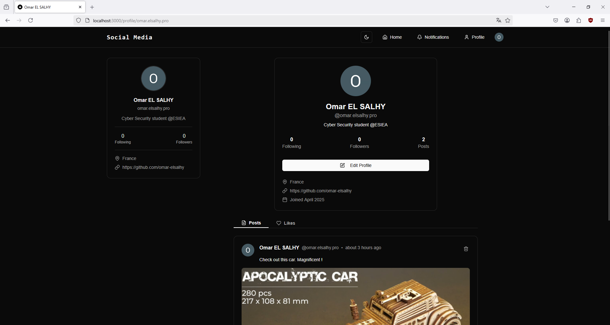

<h1 align="center">✨ Social Media Application with Node.js ✨</h1>

## 📌 Project Overview

This is a social media application built with Node.js and modern web technologies. It allows users to post content, follow other users, and interact with a dynamic community.

## 🚀 Technology Stack

- **Next.js App Router**: For building the web application with server-side rendering and routing.
- **Postgres**: Relational database for storing user data, posts, etc.
- **Prisma**: ORM to interact with the database.
- **Clerk**: Authentication and user management service for secure login/signup.
- **TypeScript**: Strongly typed programming language for better maintainability and fewer bugs.
- **Tailwind CSS**: Utility-first CSS framework for styling.
- **Shadcn**: Custom component library for UI design.
- **UploadThing**: File uploads handling.
- **Neon**: Managed PostgreSQL database service for database hosting.

## 📸 Screenshots

Here are some screenshots of the application in action:

*Home page*

*Profile page*

*Notifications page*

*Edit profile feature*

*Home page - Dark mode*

*Profile page - Dark mode*
